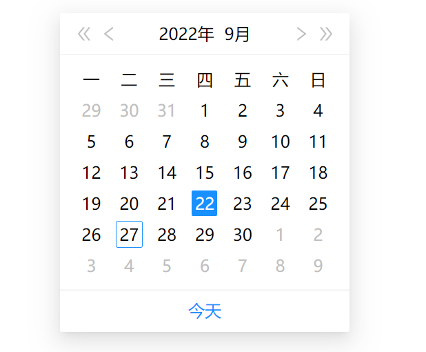

# me-date-picker组件说明

## 1、组件说明
+ 语言：JavaScript
+ 工具链：Vite
+ React函数组件(Function Component):
+ 属性说明
  ```
    <DatePicker
        value={dateString}   // 初始值，例如 "2001-01-01"
        lang={language}      // 语言，可填写 "zh"，"en"，默认 "zh"
        weekFormat={format}  // 星期格式可填写"zh"、"en"，默认"en"
    />
  ```
+ 顶部显示2个控件:  < < 2022 9 > >     
    * 年：2022
    * 月：9
+ 主体部分显示当月的日历（公历）
+ 当前选中的日期被高亮显示
    * 如果为当月，“今天”也要被标示出来
+ weekFormat支持2种排列：
    * 美式：日一二三四五六
    * 中式：一二三四五六日
+ 底部有个【今天】链接，点击之后当日期选择器的状态设置为今天

## 2、安装引入
```
    // npm安装
    npm i me-date-picker

    // yarn安装
    yarn add me-date-picker

    // 引入
    import { DatePicker } from 'me-date-picker';  // 导入组件
    import 'me-date-picker/dist/style.css';  // 导入css
```

## 3、使用demo
```
    function App() {
        const props = {
            value: "2022-9-16",
            weekFormat: "zh",
            lang: "zh",
        };

        // 用于获取选中日期值，必须要有
        const pickerRef = useRef();
        pickerRef.getValue = (value) => {
            console.log(value)
        };

        return (
            <div className="App">
                <DatePicker {...props} ref={pickerRef}></DatePicker>
            </div>
        );
    }

    export default App;
 
```

## 4、效果截图


